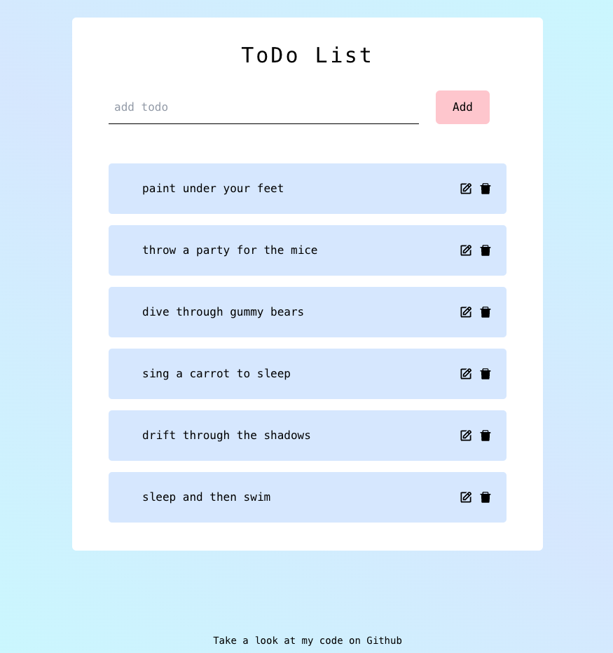
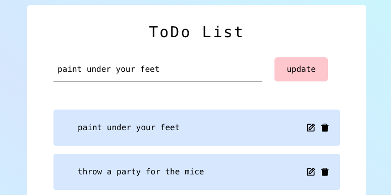

This is a MERN stack project, built using MongoDB Atlas, Mongoose Node.js, Express, Axios, React and Tailwind.

A user can list, update and delete items from the todo list. Each upate is stored in the MongoDB database, so you may find some chores that have been set by others popping up! 

Clicking on the update icon on a todo allows a user to update the content:

IMPROVEMENTS: 
- The next stage for this project will be to create a login so that a user doesn't have to take on the chores of others (because we have enough chores for ourselves already!). 
- There is a slight lag when launching this app, so the chores from the database take a 20 seconds or so to arrive - this needs improving. 
